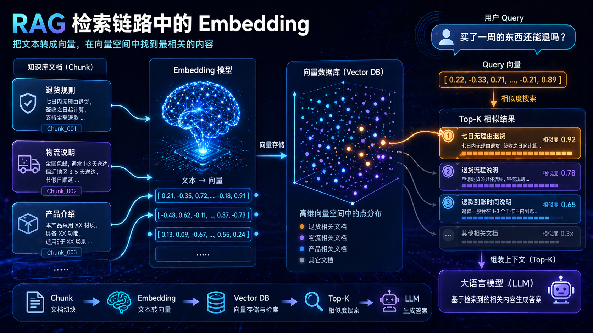
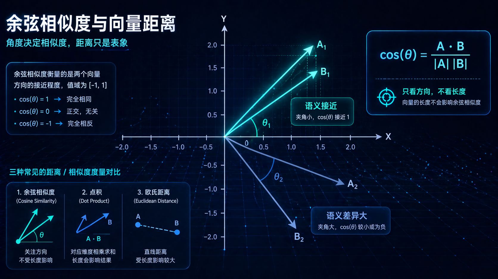
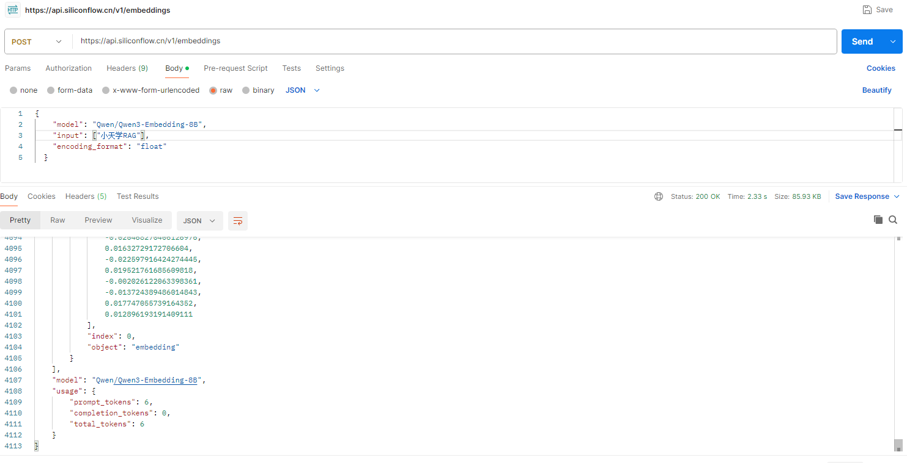
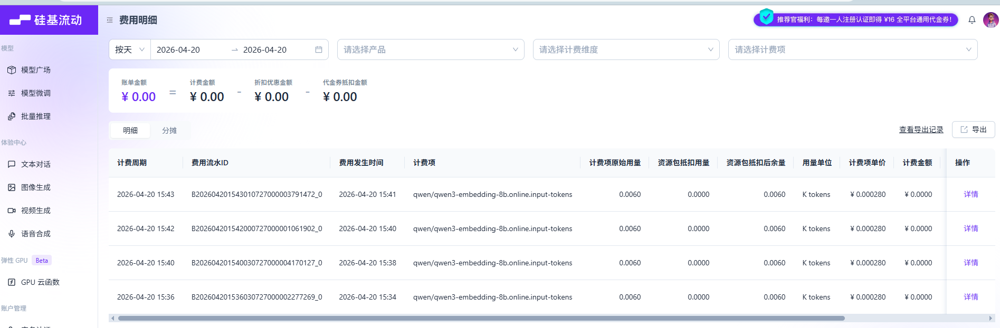
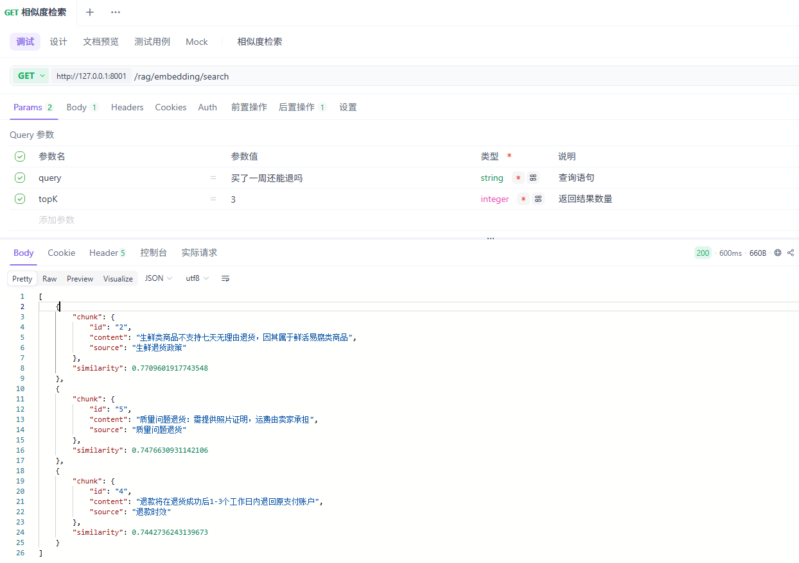
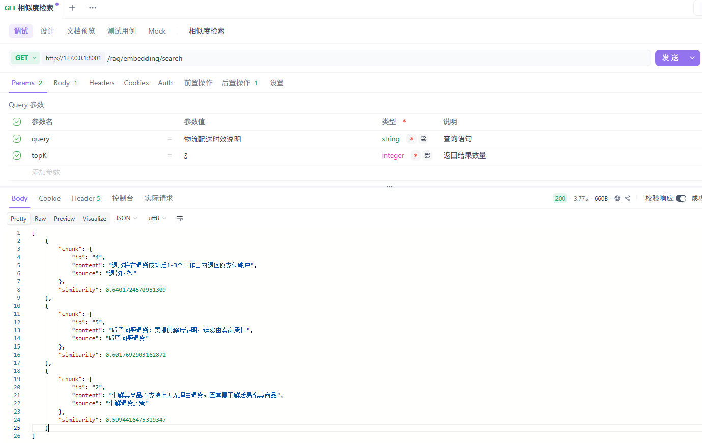

# 七、向量嵌入

前几天有个朋友问我，说他最近在看 RAG，每次看到 Embedding、余弦相似度、向量检索 这些词就发懵。

不是完全没学，是每个字都认识，连起来就不知道在说啥。

这种感觉我太懂了。

很多文章一上来就甩定义，什么高维语义空间，什么语义相似性度量，看着很专业，读完还是会冒出一个问题。

所以这玩意到底是干嘛的？

这篇我就不背教科书了，直接用人话把它讲清楚。主要聊四件事：
1、⭐️向量嵌入是什么，
2、⭐️它在 RAG 里干嘛，
3、⭐️模型怎么选，
4、⭐️⭐️项目里容易踩哪些坑。


## Embedding 是什么，为什么 RAG 离不开它

先别被「向量」吓到。

你可以把 Embedding 理解成给文本打坐标。

地图上每个地点都有坐标，Embedding 干的事也差不多，只不过它不是给文本分配二维坐标，而是给它分配一串很长的数字。

比如一段文本经过模型处理后，可能会变成 1024 个浮点数。这串数字不是给人看的，是给机器算距离用的。


核心就一句话，意思越接近的文本，转换出来的向量通常也越接近。

比如「你好」和 hello，位置可能很近。

「苹果手机」和 iPhone，也会很近。

但「苹果手机」和「水果苹果」，虽然都带苹果，语义差很远，向量距离通常也会被拉开。

所以你可以把向量嵌入理解成一个语义坐标生成器，它把人类读得懂的语言，翻成计算机能比较的数字表示。

顺手补一句，它不是靠关键词死匹配的。模型会结合上下文判断「苹果」到底是水果、手机还是公司名，这也是它比早年静态词向量强很多的原因。

## 相似度度量，余弦/点积/欧氏距离有什么区别

既然前面一直在说「近」和「远」，那就要聊一下这个距离怎么算。

工程里最常见的主要有三种。


| 方法       | 你可以怎么理解             | 特点                             |
| ---------- | -------------------------- | -------------------------------- |
| 余弦相似度 | 看两个向量方向像不像       | 最常用，对长度不那么敏感         |
| 点积       | 把对应位置的值相乘再加起来 | 计算简单，很多系统直接支持       |
| 欧氏距离   | 就像算两点之间的直线距离   | 直观，但在高维空间里不一定最好用 |

如果你刚入门，先记住余弦相似度就够了。它基本是向量检索里最常见的指标，你可以粗暴理解成，它不太关心两根箭头有多长，更关心方向是不是接近。方向越像，余弦值越接近 1，语义通常也越接近。

当然，具体用 cosine、inner product 还是 L2，最后还得看模型和数据库的配置，别想当然混着来。前面生成向量的逻辑，最好和后面检索的度量方式保持一致，不然效果容易掉。


## Embedding 在 RAG 检索链路中的位置

很多人第一次学 RAG，会觉得最厉害的是后面那个大模型。

这也没错，但如果前面的检索做歪了，后面模型再强，也只能在错误上下文上一本正经地胡说八道。

而向量嵌入，就是检索链路里最关键的翻译层。

它不是把中文翻成英文，而是把自然语言翻成机器能算相似度的数字表达。

一个典型的 RAG 流程大概是这样。

先把文档切成很多 chunk，再用同一个 Embedding 模型把每个 chunk 转成向量，连同原文和元数据一起存进向量数据库。等用户提问时，再用同一个模型把问题也转成向量，然后去库里找最接近的 Top-K 个 chunk，最后把这些内容喂给大语言模型生成答案。

所以 Embedding 干的，就是把文本送进语义空间这一步。没有这一步，后面的相似度搜索根本做不起来。

## Embedding 质量为什么直接决定召回准确率

这块特别容易被低估。

很多人做 RAG，会把精力都放在 Prompt、重排、Agent 编排这些更显眼的地方。但如果底层召回就歪了，后面再怎么补，也是在给歪地基贴瓷砖。

一个好的 Embedding 模型，能理解语义接近，而不是只盯着字面重合。

比如用户问「买了一周的东西还能退吗」，知识库里写的是「签收七日内支持无理由退货」。它们不是同一句话，关键词也不完全一样，但语义是接近的。

好的模型更容易把这两段内容拉近。

反过来，如果模型只会看表面词汇，就可能召回一堆看着相关、其实没答到点上的内容。然后大模型接过这些上下文开始生成，最后你会觉得回答也不是完全错，但就是不对劲。

很多时候，问题源头就在 Embedding 这里。

## 使用 Embedding 的三个硬约束

有几个规则很基础，但不提前知道，后面会踩得很疼。

### 第一，输入长度不是无限的

每个 Embedding 模型都有最大输入长度，有的只能吃几百个 token，有的能吃几千个。一旦超限，轻则被截断，重则直接报错。

这也是为什么做文本分块时，chunk 大小不能乱切，得保证模型吃得下。

### 第二，输出维度是固定的

同一个模型输出的向量维度通常是固定的。比如某个模型输出 1024 维，那不管你输入一个词还是一整段话，向量长度都一样。

内容变，维度不变。

这会影响后面向量库的 schema 设计，也会影响索引参数配置。

### 第三，同一批向量必须来自同一个模型

这点非常重要。

如果文档向量是模型 A 算的，那用户 query 也必须用模型 A 去算。不能今天文档用 BGE，明天查询改成 Qwen Embedding，还指望两边直接比较。

因为不同模型学到的语义空间，不是一套坐标系。

所以只要换 Embedding 模型，通常就意味着一件事，重建向量。小 Demo 里还好，生产环境里这事一点都不轻松。

## 从 Word2Vec 到 BERT，Embedding 技术演进路线

如果你想更深入理解今天的 Embedding 为什么长这样，可以简单回头看一眼它的发展路线。

最早像 Word2Vec、GloVe 这种，属于静态词向量，会给每个词分配一个固定向量。

问题在于，真实语言不是这么工作的。「苹果」在「我吃了一个苹果」和「苹果发布了新手机」里，显然不是一个意思，但静态词向量会把它们映射成同一个表示。

后来 Transformer、BERT 这类模型起来之后，词向量开始变成上下文相关。同一个词放在不同句子里，可以得到不同表示，一词多义的问题才算真正有了更靠谱的解法。

再往后，RAG、检索、排序这些场景越来越火，大家对 Embedding 的要求也越来越具体，不只是要通用，还要适合检索、适合多语言、适合长文本，最好在法律、医疗、电商这些垂直领域里也能打。

所以现在你会看到很多专门为 retrieval 优化的模型，这不是把系统搞复杂，而是场景真的不一样。

## 如何选 Embedding 模型，MTEB 榜单怎么看

这件事特别像选数据库。

很多时候不是比谁最强，而是比谁更适合现在这个局面。

### 先看公开榜单，但别迷信榜单

公开评测里，MTEB 是非常常见的参考基准。

[MTEB，Massive Text Embedding Benchmark](https://huggingface.co/spaces/mteb/leaderboard)


这张图至少能帮你快速过滤掉一批明显不合适的模型。

横轴一般是参数量，纵轴是平均任务得分，气泡大小通常对应嵌入维度，颜色一般对应最大处理长度。你扫一眼，大概就知道谁更强、谁更大、谁更贵、谁更能吃长文本。

但榜单只是公共赛场的成绩，不是你业务现场的最终判决书。你做中文客服知识库，和别人做英文学术检索，根本不是一回事。你做法律条文召回，和别人做电商商品匹配，也完全不是一回事。

所以榜单能给你方向，不能替你拍板。

### 真正要看的，是这几个维度

如果你是在做 RAG，至少要盯住下面几个点。


| 维度     | 你真正该关心什么                             |
| -------- | -------------------------------------------- |
| 检索能力 | 在 Retrieval 任务上的表现怎么样，别只看总分  |
| 语言支持 | 中文、多语言、行业术语，它到底擅不擅长       |
| 模型大小 | 你的机器带不带得动，吞吐和延迟能不能接受     |
| 向量维度 | 精度、存储、计算成本之间怎么平衡             |
| 最大长度 | 这会直接影响你的 chunk 策略                  |
| 成本     | API 单价、自部署硬件、运维成本，最后都得算账 |

这里最容易被忽略的是语言和场景。很多人默认榜单高分 = 我这里效果也高，真不一定。尤其是中文场景，或者行业语料很重的场景，公开榜单只能参考，不能迷信。

### 最靠谱的方法，还是自己做一轮评测

如果项目真要上线，最稳的办法不是拍脑袋，而是自己拉一套评测集。

先确定几个候选模型，三到五个差不多。然后用真实业务问题做样本，每条样本最好都包含一个用户问题，以及它理论上最该召回的标准 chunk 或文档。

接着把这些模型都跑一遍，看 Top1 对不对，Top3、Top5 里有没有关键内容，特别容易混淆的问题会不会召回到错误知识。

如果你愿意更细一点，还可以把误召回案例单独拿出来分析。这样你能清楚看到，模型错不是错在分数低，而是错在什么类型的问题上。

## 向量维度该怎么选，高维一定更好吗

不一定。

高维度通常意味着更强的表达能力，但也意味着更高的存储成本、更高的计算成本，以及更重的索引压力。

你可以把维度理解成描述文本时使用的特征数量。特征少，描述更粗。特征多，描述更细。但工程世界里，很多事情一旦更细，代价也就跟着来了。


| 维度范围     | 常见适用场景             | 100 万条向量的大致存储成本 |
| ------------ | ------------------------ | -------------------------- |
| 256 到 512   | 轻量场景，文本短、类别少 | 约 1 到 2 GB               |
| 768 到 1024  | 大多数生产环境的平衡点   | 约 3 到 4 GB               |
| 1536 到 4096 | 对精度要求很高的重场景   | 约 6 到 16 GB              |

对于大多数中文 RAG 项目，768 到 1024 维通常是一个比较稳的区间，精度和成本相对平衡。除非你的场景特别吃精度，不然没必要一上来就冲超高维。

## 大规模向量检索，KNN 之外还有哪些 ANN 方案

如果库里只有几百条、几千条向量，直接一条一条算过去也不是不行。

但数据量一旦到了百万、千万，甚至更高，这事就会开始变得痛苦。因为暴力扫描全库，时间复杂度会跟数据量线性增长，每次查询都把整个库翻一遍，性能很难扛住。

### KNN 很准，但通常不适合海量数据

KNN 的思路最直接，把查询向量和库里每个向量都算一遍距离，然后选最近的 K 个。

它很准，但问题也很明显，太慢。

所以工业界更常用的是 ANN，近似最近邻搜索。它会牺牲一点点精度，换来大幅度性能提升，这笔账通常是划算的。

### IVF 像先分区，再进区里找

IVF 可以把它想成图书馆分区。

不是每次找书都把全馆跑一遍，而是先判断你大概该去哪个区域，再在那个区域里找。

在向量世界里，它会先把数据聚成若干簇。检索时先找到离查询向量最近的几个簇，再去这些簇内部做更细搜索，所以速度会快很多。

### HNSW 为什么这么常见

如果你看过 Milvus、Faiss、pgvector、Weaviate 这些资料，大概率经常会遇到 HNSW。

你可以把它理解成一个多层导航网络，上层节点少、跨度大，像高速路，下层节点多、连接密，像城市街道。搜索时先从上层快速逼近目标区域，再一层层往下钻，最后在底层做精细搜索。

它常见，是因为兼顾了速度和召回率。一般来说，HNSW 的优点是检索快、效果稳、召回率高，而且支持动态插入。缺点是索引构建更花时间，内存也更吃紧。

### LSH 更像极致粗筛

LSH 的思路更偏概率一点。它会设计特殊哈希方式，让语义接近的向量更可能落进相同桶里。这样查询时就不用全库搜索，而是先去可能相关的桶里捞。

速度会很快，但召回稳定性往往没有 HNSW 那么稳，所以它更适合特别强调粗筛速度的场景。

### 真落地时怎么选

如果你只是想先做一个大多数情况下都不太容易出错的选择，HNSW 往往是很稳的起点。

如果内存压力特别大，或者数据规模非常夸张，才会更认真地考虑 IVF、PQ 这一类压缩和分层方案。LSH 也有自己的位置，但通常不是默认答案。

工程很多时候不是追最强，而是追够强、可控、你现在能扛住。

## 动手实践，用 SiliconFlow API 跑通向量化全流程

概念聊到这里，其实已经够你建立一个大概认知了。

但真想把这事吃透，最好还是自己跑一遍。看着文本变成向量，看着 query 和 chunk 算相似度，看着 Top-K 结果排出来，那一瞬间你会突然明白，原来 RAG 前面的检索链路就是这么转起来的。

这一节我用 SiliconFlow 的 Embedding API 举个例子，它的好处是接口兼容 OpenAI 风格，直接发 HTTP 请求就能用，上手门槛比较低。

### SiliconFlow 这条链路是怎么跑起来的

SiliconFlow 提供了不少模型 API，其中也包括 Embedding 模型，拿来做演示很合适。

你先注册账号，然后在控制台创建 API Key，再选一个 Embedding 模型，比如 [Qwen/Qwen3-Embedding-8B](rag/docs/七、向量嵌入.md:220)。对中文场景来说，这个模型的表现通常还不错。

如果你只是想快速验证一遍向量化流程，平台给的新用户免费额度基本也够用。

新人代金券链接放这里。

https://cloud.siliconflow.cn/i/WdXa2gje

### 示例请求

在写 Java 代码之前，先直接看一眼 HTTP 请求，会更容易建立直觉。

```bash
curl -X POST "https://api.siliconflow.cn/v1/embeddings" \
  -H "Authorization: Bearer 你的API_KEY" \
  -H "Content-Type: application/json" \
  -d '{
    "model": "Qwen/Qwen3-Embedding-8B",
    "input": ["小天学RAG"],
    "encoding_format": "float"
  }'
```

这里你重点盯三个字段就行。

[`model`](rag/docs/七、向量嵌入.md:241)，指定到底用哪个嵌入模型。

[`input`](rag/docs/七、向量嵌入.md:243)，就是要转成向量的文本，单条和批量都可以。

[`encoding_format`](rag/docs/七、向量嵌入.md:245)，决定返回的数据格式，常见就是 `float`。

执行之后，返回体里最重要的是 [`data`](rag/docs/七、向量嵌入.md:251) 数组。数组里的每个元素对应一条输入文本，而其中的 [`embedding`](rag/docs/七、向量嵌入.md:251) 字段，就是最终生成的向量。



另外还会有 [`usage`](rag/docs/七、向量嵌入.md:251) 之类的信息，方便你看 token 消耗和费用情况。



### 一个最小可跑通的检索链路

如果你只是想验证 Embedding 在 RAG 里怎么接上去，那最小闭环其实很简单。

先准备几段 chunk 文本，把这些 chunk 调用 Embedding API 转成向量。用户发来 query，再转一次向量。然后自己在代码里算余弦相似度，最后按得分排序，取最像的几个结果返回。

这就是一个非常迷你的检索闭环。

演示里，我这边给了两个效果图。

用户问「买了一周的东西还能退吗」的时候，系统会返回最接近退货规则的回答。



用户问「物流配送时效说明」的时候，也会去匹配对应说明。



真正承载这条逻辑的核心代码，在 [`EmbeddingSearchService`](https://github.com/tyronczt/hello-ai/blob/main/rag/src/main/java/cn/tyron/llm/embedding/EmbeddingSearchService.java) 里。

## 生产环境落地，有哪些关键工程决策

跑通 Demo 只是开始。

真正进项目之后，很多麻烦不是你不会调 API，而是你一开始的几个决策没想清楚，后面改起来特别疼。

### 用云端 API，还是自己本地部署

这是个很典型的工程取舍题。

云端 API 的好处很明显，快、省事、前期验证成本低。你不用自己搭推理服务，不用盯显卡利用率，也不用管模型加载和扩缩容，按量付费，先把效果做出来再说。

但问题也明显，数据会出内网，网络延迟不可控，量大之后成本也未必便宜。

本地部署则是另一种交换，你拿硬件和运维复杂度，换更强的数据可控性和更低的时延。金融、医疗、政务这种场景，很多时候压根没得选，就是得本地。

如果你只是想先在本机把链路跑通，像 Ollama 这种路线会轻松很多，迁移思路和云端 API 也差不了太多。

### 什么时候必须重新向量化

这个问题很多人都是线上出事了才意识到。

常见触发条件无非就几种，换模型了，文档内容更新了，分块策略改了，模型版本升级了。这几种情况都会影响原有向量的可比性或者有效性。

所以比较稳妥的做法是，在元数据里把 [`embedding_model`](rag/docs/七、向量嵌入.md:293) 和 [`embedding_model_version`](rag/docs/七、向量嵌入.md:293) 这类信息记清楚。后面不管排查问题、做灰度还是切换版本，都会轻松很多。

## 小结

如果你一路看到这里，其实向量嵌入已经没那么玄乎了。

它干的核心事情，就是把文本变成机器能比较的语义坐标，再让检索系统去找谁离谁更近。而 RAG 前面那一大段检索链路，能不能把对的 chunk 先捞出来，很多时候就看这一层做得好不好。

你如果只记三件事，我觉得够了。

第一，Embedding 不是关键词匹配，它更关心语义上的接近。

第二，模型选择不能只看榜单，要看语言、场景、成本和实际评测结果。

第三，换模型、改文档、调分块，这些动作都可能触发重新向量化，别等系统跑起来了才后知后觉。

再往后一步，向量有了，总得找个地方存吧。几百万条、几千万条向量，到底怎么高效检索。

这时候，**向量数据库**就该登场了。

下一篇，我们接着聊这个。
