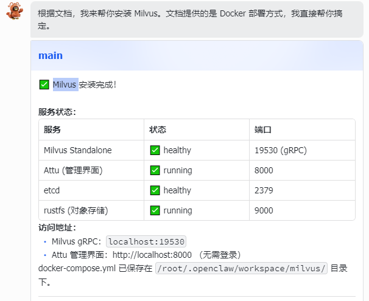
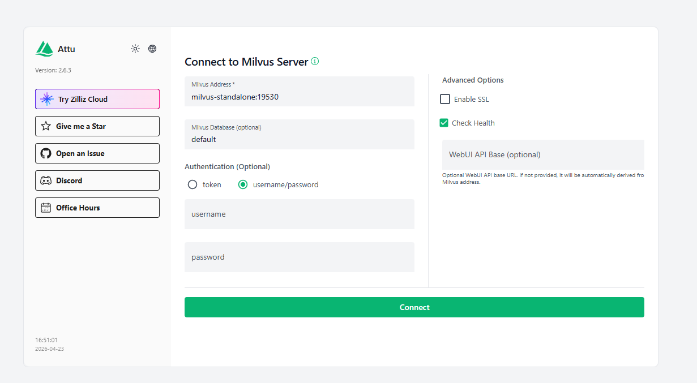

# 八、向量数据库

上一篇我们把文本 chunk 变成了一组浮点数向量，还用 SiliconFlow 的 API 跑通了一个完整的向量化检索 demo。最后留了一个问题：向量生成之后存到哪里？

当时的 demo 里，我们把所有向量放在一个 `List<float[]>` 里，查询的时候遍历整个列表，逐个算余弦相似度，取最高的几个。demo 跑得很顺畅，因为只有几条数据。

但你想想实际场景——一个电商平台的知识库，商品说明、退货政策、物流规则、促销活动、FAQ……分块之后轻轻松松几十万甚至上百万个 chunk，每个 chunk 对应一个 4096 维的向量。每次用户提问，你都要拿查询向量和这几十万个向量逐一比较？

这显然不现实。

这一篇，我们就来解决这个问题：向量存到哪里，怎么在海量向量中高效检索。

## 向量存到哪里：为什么普通数据库不够用

### 1. 最直觉的方案：用 MySQL 存向量

既然向量就是一组浮点数，那最直觉的想法就是——存 MySQL 呗。

方案很简单：在表里加一个 `TEXT` 或 `JSON` 字段，把向量序列化成字符串存进去。检索的时候把所有向量读出来，在应用层逐个计算余弦相似度，排序取 Top-K。

```sql
CREATE TABLE chunk_vectors (
    id BIGINT PRIMARY KEY AUTO_INCREMENT,
    chunk_text TEXT NOT NULL,
    vector JSON NOT NULL,          -- 存储 4096 维浮点数向量
    doc_id VARCHAR(64),
    category VARCHAR(32),
    created_at DATETIME DEFAULT CURRENT_TIMESTAMP
);
```

能跑通吗？能。demo 阶段完全没问题。

但这个方案有一个致命的问题——检索的时候，你必须把所有向量都读出来，在内存里逐个计算相似度。这就是所谓的暴力搜索（Brute-Force Search）。

### 2. 暴力搜索的性能瓶颈

咱们算一笔账。

假设你的知识库有 100 万个 chunk，每个 chunk 的向量是 4096 维（用的 Qwen3-Embedding-8B 模型）。每次用户提问，系统需要：

1. 把用户的问题也向量化，得到一个 4096 维的查询向量
2. 从数据库里读出 100 万个向量
3. 逐个计算查询向量和这 100 万个向量的余弦相似度
4. 排序，取相似度最高的 Top-K 个

第 3 步是瓶颈。每次余弦相似度计算需要做 4096 次乘法 + 4096 次加法 + 开方等运算。100 万个向量就是 100 万次这样的计算。

具体要多久？在一台普通服务器上（单核 CPU），100 万个 4096 维向量的暴力搜索大约需要 2\~5 秒。听起来好像还行？

但别忘了：

* 这只是单次查询的耗时，如果有 100 个用户同时提问呢？
* 数据量还会增长，500 万、1000 万个 chunk 呢？
* 实际的 RAG 系统对延迟很敏感，用户问一个问题不只是向量检索，还有很多其他步骤，体验很差
* 而且每次查询都要把 100 万个向量从磁盘读到内存，I/O 开销也很大

用一张图来直观感受一下暴力搜索的过程：


所以，暴力搜索在数据量小的时候没问题，但一旦数据量和并发量上去，就完全不可用了。

### 3. 近似最近邻搜索

既然逐个比较太慢，能不能不比较所有向量，只比较其中一部分，就找到大概率最相似的那几个？

答案是可以。这就是 **ANN**（Approximate Nearest Neighbor，近似最近邻搜索）的核心思想。

注意这里的关键词是“近似”——ANN 不保证找到的一定是全局最相似的向量，但它能在极短的时间内找到非常接近最优解的结果。

打个比方：暴力搜索就像你要在一个 100 万人的城市里找和你最像的人，挨个去比对。ANN 则是先按区域划分，再按特征缩小范围，最后只在一小撮人里精确比较。你可能会错过某个住在偏远角落的“最佳匹配”，但你找到的人已经足够像了，而且速度快了几百倍。

用数字来感受一下差距：


| 指标               | 暴力搜索     | ANN 检索         |
| ------------------ | ------------ | ---------------- |
| 100 万向量查询耗时 | 2\~5 秒      | 1\~10 毫秒       |
| 召回率（Recall）   | 100%（精确） | 95%\~99%（近似） |
| 是否需要专门索引   | 不需要       | 需要             |
| 适用数据量         | < 10 万      | 百万\~亿级       |

1~10 毫秒 vs 2~5 秒，速度差了几百到几千倍，而召回率只损失了 1%\~5%。在实际的 RAG 场景中，这点精度损失几乎感知不到——你本来就是取 Top-K 个结果丢给大模型做参考，少了一个排名第 47 的 chunk 对最终回答没有影响。

这就是向量数据库存在的核心理由：它不只是存向量，更重要的是提供高效的 ANN 检索能力。普通数据库能存向量，但做不了高效的 ANN 检索。

> 一句话概括：向量数据库 = 向量存储 + ANN 索引 + 高效检索。它是专门为“在海量向量中快速找到最相似的那几个”这件事而设计的。

## 向量检索的核心算法：怎么不用逐个比较就能找到最相似的

知道了 ANN 的目标——不逐个比较，快速找到近似最优解——接下来的问题是：具体怎么做到的？

这一节我们讲两种最主流的 ANN 索引算法：IVF 和 HNSW。不涉及数学推导，重点是让你理解它们的核心思想和工程上的取舍。

### 1. 类比：在一本 10 万页的字典里查一个词

在讲具体算法之前，先想一个生活中的场景。

你手上有一本 10 万页的字典，要查 `serendipity` 这个词。你会怎么做？

肯定不会从第 1 页翻到第 100000 页。你会：

1. 先看目录，确定 S 开头的词在哪个范围
2. 翻到大概的位置，再根据前几个字母缩小范围
3. 最后在一小段页面里精确查找

这个过程的本质是：通过某种结构（目录、索引），把搜索范围从“全部”缩小到“一小部分”，然后在小范围内精确查找。

向量索引的思路完全一样——只不过字典里的“词”变成了“向量”，字母顺序变成了空间位置。

### 2. IVF（倒排文件索引）：先分区再搜索

IVF 的全称是 Inverted File Index（倒排文件索引）。名字听起来很学术，但思路非常直觉。

#### 2.1 IVF 的工作原理

IVF 的核心思想就一句话：把向量空间划分成若干个区域，查询时只在最可能的几个区域里搜索。

具体怎么做？分两个阶段：

建索引阶段（离线）：

1. 用聚类算法（通常是 K-Means）把所有向量分成 `nlist` 个簇（cluster）
2. 每个簇有一个中心点（centroid），代表这个簇里所有向量的"平均位置"
3. 每个向量被分配到离它最近的那个簇

检索阶段（在线）：

1. 拿到查询向量后，先计算它和所有簇中心点的距离
2. 找到最近的 `nprobe` 个簇（nprobe 是一个可调参数）
3. 只在这 `nprobe` 个簇里的向量中做精确搜索

打个比方：你要在一个大型图书馆里找一本关于“Java 并发编程”的书。IVF 的做法是——先看楼层指引，确定计算机类在 3 楼，编程语言在 3 楼 A 区，然后只在 3 楼 A 区的书架上找。你不需要把整个图书馆的书都翻一遍。


假设 `nlist = 100`（分成 100 个簇），`nprobe = 10`（查询时搜索 10 个簇），那么每次查询只需要搜索大约 10% 的向量，速度提升约 10 倍。

#### 2.2 IVF 的优缺点


| 优点                                   | 缺点                                     |
| -------------------------------------- | ---------------------------------------- |
| 原理简单，容易理解和调优               | 需要训练聚类模型（数据量大时训练较慢）   |
| 内存占用相对较低                       | 聚类边界处的向量可能被漏掉（影响召回率） |
| 适合数据量非常大的场景                 | nlist 和 nprobe 的调参需要经验           |
| 支持增量插入（但可能需要定期重新聚类） | 数据分布不均匀时效果下降                 |

> IVF 还有几个变体：IVF\_FLAT 是在簇内做精确搜索，IVF\_SQ8 是对簇内向量做量化压缩以节省内存，IVF\_PQ 则用乘积量化进一步压缩。后面的选型表格里会对比它们的差异。

### 3. HNSW（分层可导航小世界图）：最主流的索引算法

HNSW 的全称是 Hierarchical Navigable Small World Graph（分层可导航小世界图）。名字很长，但它是目前最主流、效果最好的 ANN 索引算法，几乎所有向量数据库都把它作为默认或推荐的索引类型。

#### 3.1 HNSW 的核心思想：多层图结构

要理解 HNSW，先从一个生活场景开始。

假设你要找一个"住在北京朝阳区、会写 Java、喜欢打篮球"的人，但你手上没有任何名单，只能通过社交关系去找。你会怎么做？

你不会挨个问全中国 14 亿人。你会这样：

1. 先在你认识的人里找——“谁在北京？”——你的朋友老王在北京
2. 问老王——“你认识朝阳区的人吗？”——老王介绍了他同事小李
3. 问小李——“你认识会写 Java 的人吗？”——小李介绍了他的大学同学张三
4. 张三恰好也喜欢打篮球——找到了！

每一步你都在靠近目标，而且每一步只需要问几个人，不需要遍历所有人。

HNSW 的思路和这个完全一样，只不过把“人”换成了“向量”，把“社交关系”换成了“图中的边”。

HNSW 的核心结构是一个多层图：

* 最底层（Layer 0）包含所有向量，每个向量和它附近的若干个向量相连
* 往上每一层的向量数量越来越少（随机抽取），但连接的跨度越来越大
* 最顶层只有很少的几个向量，但它们之间的连接覆盖了整个向量空间

检索的时候，从最顶层开始，快速定位到目标的大致区域，然后逐层下降，每一层都在更精细的范围内搜索，最终在最底层找到最相似的向量。


#### 3.2 用一个具体例子走一遍 HNSW 的检索过程

为了让你更直观地理解，咱们用一个简化的例子走一遍。

假设向量数据库里有 8 个向量（A、B、C、D、E、F、G、H），HNSW 建了 3 层图。现在要查询和向量 Q 最相似的向量。

Layer 2（顶层）：只有 A 和 E 两个向量

* 从 A 开始，计算 Q 和 A 的距离、Q 和 E 的距离
* 发现 E 离 Q 更近，移动到 E

Layer 1（中间层）：有 A、C、E、G 四个向量

* 从 E 出发，看 E 的邻居：C 和 G
* 计算 Q 和 C、Q 和 G 的距离
* 发现 G 离 Q 更近，移动到 G

Layer 0（底层）：所有 8 个向量都在

* 从 G 出发，看 G 的邻居：F 和 H
* 计算 Q 和 F、Q 和 H 的距离
* 发现 H 离 Q 最近
* 再看 H 的邻居，没有比 H 更近的了
* 结果：H 是和 Q 最相似的向量

整个过程只计算了 6 次距离（A、E、C、G、F、H），而不是 8 次。数据量小的时候差距不明显，但如果有 100 万个向量，HNSW 通常只需要计算几百到几千次距离就能找到结果。

#### 3.3 为什么 HNSW 这么快

HNSW 快的原因可以归结为两点：

第一，多层结构实现了“粗到细”的搜索。顶层的少量向量帮你快速跳到目标附近，底层的密集连接帮你精确定位。这和跳表（Skip List）的思想很像——如果你了解 Redis 的有序集合（ZSet），它底层用的就是跳表，原理是相通的。

第二，“小世界”特性保证了图的连通性。在 HNSW 的图中，任意两个向量之间只需要经过很少的“跳转”就能到达（类似“六度分隔理论”——你和世界上任何一个人之间最多只隔 6 个人）。这意味着搜索不会陷入死角，总能快速逼近目标。

#### 3.4 HNSW 的代价：内存占用

HNSW 的检索速度和精度都很优秀，但它有一个明显的代价：内存占用大。

因为 HNSW 需要在内存中维护整个图结构——不仅要存所有向量本身，还要存向量之间的连接关系（边）。每个向量在每一层都有若干条边，这些边的存储开销不小。

具体来说，HNSW 有两个关键参数影响内存和性能：


| 参数           | 含义                       | 调大的效果                               | 调小的效果                   |
| -------------- | -------------------------- | ---------------------------------------- | ---------------------------- |
| M              | 每个向量在每层的最大连接数 | 召回率更高，但内存占用更大，建索引更慢   | 内存省，但召回率可能下降     |
| efConstruction | 建索引时的搜索宽度         | 索引质量更高（连接更合理），但建索引更慢 | 建索引快，但索引质量可能下降 |

检索时还有一个参数 `ef`（搜索宽度），控制检索时探索的候选集大小。`ef` 越大，召回率越高，但检索越慢。

> 一个粗略的估算：100 万个 4096 维向量，用 HNSW 索引（M=16），大约需要 16\~20 GB 内存。如果你的服务器内存有限，可能需要考虑 IVF 系列索引，它们的内存占用要小得多。

### 4. 索引算法对比：怎么选

Milvus 支持多种索引类型，下面是最常用的几种对比：


| 索引类型  | 核心思想                | 检索速度 | 召回率       | 内存占用             | 适用数据量 | 适用场景                           |
| --------- | ----------------------- | -------- | ------------ | -------------------- | ---------- | ---------------------------------- |
| FLAT      | 暴力搜索，不建索引      | 最慢     | 100%（精确） | 低（只存原始向量）   | < 10 万    | 对精度要求极高，数据量小           |
| IVF\_FLAT | 聚类分区 + 簇内精确搜索 | 快       | 95%\~99%     | 较低                 | 百万\~千万 | 数据量大，内存有限                 |
| IVF\_SQ8  | 聚类分区 + 标量量化压缩 | 快       | 93%\~97%     | 低（向量压缩为 1/4） | 千万\~亿级 | 数据量很大，愿意牺牲一点精度换内存 |
| HNSW      | 多层图结构              | 最快     | 97%\~99.5%   | 高（需存图结构）     | 百万\~千万 | 对速度和精度都有要求，内存充足     |
| DISKANN   | 基于磁盘的图索引        | 较快     | 95%\~98%     | 低（索引在磁盘）     | 亿级       | 数据量极大，内存不够放 HNSW        |

怎么选？一个简单的决策路径：

* 数据量 < 10 万，直接用 FLAT，暴力搜索就够了
* 数据量 10 万\~500 万，内存充足 → HNSW；内存有限 → IVF\_FLAT
* 数据量 500 万\~5000 万，HNSW 如果内存放得下就用 HNSW，放不下用 IVF\_SQ8
* 数据量 > 5000 万，考虑 DISKANN 或 IVF\_PQ

对于大多数 RAG 项目来说，数据量在百万级别，HNSW 是最优选择。这也是为什么后面的实战代码里我们用 HNSW 作为索引类型。

## [一、向量数据库的作用](https://datawhalechina.github.io/all-in-rag/#/chapter3/08_vector_db?id=一、向量数据库的作用-1)

在前面我们学习了如何使用嵌入模型将文本、图像等非结构化数据转换为高维向量。这些向量是 RAG 系统能够进行语义理解的基础。然而，当向量数量从几百个增长到数百万甚至数十亿时，一个核心问题随之而来：**如何快速、准确地从海量向量中找到与用户查询最相似的那几个？**

### [1.1 向量数据库主要功能](https://datawhalechina.github.io/all-in-rag/#/chapter3/08_vector_db?id=_11-向量数据库主要功能-1)

向量数据库的核心价值在于其高效处理海量高维向量的能力。其主要功能可以概括为以下几点：

- **高效的相似性搜索**：这是向量数据库最重要的功能。它利用专门的索引技术（如 HNSW, IVF），能够在数十亿级别的向量中实现毫秒级的近似最近邻（ANN）查询，快速找到与给定查询最相似的数据。
- **高维数据存储与管理**：专门为存储高维向量（通常维度成百上千）而优化，支持对向量数据进行增、删、改、查等基本操作。
- **丰富的查询能力**：除了基本的相似性搜索，还支持按标量字段过滤查询（例如，在搜索相似图片的同时，指定`年份 > 2023`）、范围查询和聚类分析等，满足复杂业务需求。
- **可扩展与高可用**：现代向量数据库通常采用分布式架构，具备良好的水平扩展能力和容错性，能够通过增加节点来应对数据量的增长，并确保服务的稳定可靠。
- **数据与模型生态集成**：与主流的 AI 框架（如 LangChain, LlamaIndex）和机器学习工作流无缝集成，简化了从模型训练到向量检索的应用开发流程。

### [1.2 向量数据库 vs 传统数据库](https://datawhalechina.github.io/all-in-rag/#/chapter3/08_vector_db?id=_12-向量数据库-vs-传统数据库-1)

传统的数据库（如 MySQL）擅长处理结构化数据的精确匹配查询（例如，`WHERE age = 25`），但它们并非为处理高维向量的相似性搜索而设计的。在庞大的向量集合中进行暴力、线性的相似度计算，其计算成本和时间延迟无法接受。**向量数据库 (Vector Database)** 很好的解决了这一问题，它是一种专门设计用于高效存储、管理和查询高维向量的数据库系统。在 RAG 流程中，它扮演着“知识库”的角色，是连接数据与大语言模型的关键桥梁。

向量数据库与传统数据库的主要差异如下：


| **维度**         | **向量数据库**                        | **传统数据库 (RDBMS)**                         |
| ---------------- | ------------------------------------- | ---------------------------------------------- |
| **核心数据类型** | 高维向量 (Embeddings)                 | 结构化数据 (文本、数字、日期)                  |
| **查询方式**     | **相似性搜索** (ANN)                  | **精确匹配**                                   |
| **索引机制**     | HNSW, IVF, LSH 等 ANN 索引            | B-Tree, Hash Index                             |
| **主要应用场景** | AI 应用、RAG、推荐系统、图像/语音识别 | 业务系统 (ERP, CRM)、金融交易、数据报表        |
| **数据规模**     | 轻松应对千亿级向量                    | 通常在千万到亿级行数据，更大规模需复杂分库分表 |
| **性能特点**     | 高维数据检索性能极高，计算密集型      | 结构化数据查询快，高维数据查询性能呈指数级下降 |
| **一致性**       | 通常为最终一致性                      | 强一致性 (ACID 事务)                           |

向量数据库和传统数据库并非相互替代的关系，而是**互补关系**。在构建现代 AI 应用时，通常会将两者结合使用：利用传统数据库存储业务元数据和结构化信息，而向量数据库则专门负责处理和检索由 AI 模型产生的海量向量数据。

## [二、工作原理](https://datawhalechina.github.io/all-in-rag/#/chapter3/08_vector_db?id=二、工作原理)

向量数据库的核心是高效处理高维向量的相似性搜索。向量是一组有序的数值，可以表示文本、图像、音频等复杂数据的特征或属性。在 RAG 系统中，向量一般通过嵌入模型将原始数据转换为高维向量表示，比如上一节的图文示例。向量数据库通常采用四层架构，通过存储层、索引层、查询层和服务层的协同工作来实现高效相似性搜索，其中存储层负责存储向量数据和元数据，优化存储效率并支持分布式存储；索引层维护索引算法（HNSW、LSH、PQ等），负责索引的创建与优化，并支持索引调整；查询层处理查询请求，支持混合查询并实现查询优化；服务层管理客户端连接，提供监控和日志能力，并实现安全管理。

主要技术手段包括：

- **基于树的方法**：如 Annoy 使用的随机投影树，通过树形结构实现对数复杂度的搜索
- **基于哈希的方法**：如 LSH（局部敏感哈希），通过哈希函数将相似向量映射到同一“桶”
- **基于图的方法**：如 HNSW（分层可导航小世界图），通过多层邻近图结构实现快速搜索
- **基于量化的方法**：如 Faiss 的 IVF 和 PQ，通过聚类和量化压缩向量

## [三、主流向量数据库介绍](https://datawhalechina.github.io/all-in-rag/#/chapter3/08_vector_db?id=三、主流向量数据库介绍)


向量数据库如何选型？
向量数据库的核心作用就是支持检索增强生成。我们再回顾下RAG中与向量数据库相关的流程：
将私有数据（如文档、知识库）转换成向量，存储在向量数据库中。
当用户提问时，Spring AI 首先将用户的问题也转换成一个向量。
然后去向量数据库中进行相似性搜索，找出与问题向量最接近的几个数据块（即上下文）。
最后，将用户的问题和检索到的上下文信息一起发送给大模型，生成更准确、更相关的答案。
Spring AI 通过统一的 VectorStore 接口来屏蔽底层不同向量数据库的实现差异，使得开发者可以灵活插拔和更换具体的产品。构建企业知识库时，数据（如内部文档、代码、客户信息）是核心资产，通常具有高度敏感性。因此，我们这边主要介绍可以私有化部署的向量数据库（如pinecone只支持云服务），确保数据保留在我们企业内部。
Spring AI官方支持的向量库：https://docs.spring.io/spring-ai/reference/api/vectordbs.html
向量数据库选型的核心关注点
在向量数据库的选型中，没有“最好的”，只有“最合适的”。

关键是根据自身业务特征，选择在性能、运维、扩展性和生态之间平衡最优的方案。向量数据库的本质任务是支持高维向量的高效相似度检索，因此选型时我们应重点关注以下几个方面。
部署复杂度
首先要考虑的是系统的“上手难度”和“维护成本”。有些数据库（如 Chroma）非常轻量，可以直接嵌入应用中，适合开发和原型阶段；而另一些（如 Milvus）则是分布式架构，需要容器化部署和专业运维。选择时要评估团队的技术能力、资源投入，以及是否有对 Kubernetes、云部署的支持需求。部署复杂度越高，后期的维护成本也会越大。
检索性能
性能是硬指标，也是最直观的评估维度。向量检索性能主要包括查询延迟（响应速度）和吞吐量（并发能力）。同时还要考虑资源消耗，尤其是内存使用，因为大多数向量索引需要常驻内存。换句话说，性能不仅影响体验，也直接决定了系统的硬件成本。
可扩展性
可扩展性，一方面要看是否支持垂直扩展（提升单机性能），另一方面要看能否水平扩展（分布式部署）。对于数据规模持续增长的系统，原生支持分布式架构的数据库（如 Milvus、Qdrant）更具优势；而对于中小规模、数据相对稳定的项目，轻量级数据库如 Chroma 或 pgvector 会更加经济高效。
方便集成
在企业环境中，集成便利性往往比性能更重要。选型时要优先考虑与现有系统的兼容性，比如已有 PostgreSQL，则可以直接使用 pgvector 扩展，无需引入新的数据库；如果已有 Elasticsearch，则可以利用其内置的向量检索功能，轻松实现语义+关键词的混合搜索。避免为了一个功能引入全新的技术栈，是选型中非常实际的智慧。
高级特性
高级特性体现了数据库的灵活性和拓展能力。例如是否支持元数据过滤，这个是非常重要的功能，所以如果没有这个功能，在生产环境上的话，基本可以排除掉了。还有是否支持混合检索，是否提供向量更新、版本管理或复杂过滤表达式等功能。这些特性直接影响系统能否在复杂业务场景下保持准确性与可控性，也是从“能用”到“好用”的分水岭。
社区活跃度
最后要关注项目的活跃度，一个活跃的社区意味着持续的优化、可靠的 bug 修复和丰富的学习资料。选择使用一个成熟的、久经考验的工具，远比一个新工具要稳妥的多。
向量数据库

PgVector
定位：
PGvector 是 PostgreSQL 的一个扩展（Extension），让传统关系型数据库也能存储和检索向量。你只需要在现有的 PostgreSQL 数据库上执行 CREATE EXTENSION vector; 就能拥有向量存储和搜索能力。
特点与优势：
无需引入新数据库，直接基于 PostgreSQL 使用，保证你的项目数据源的统一；
支持 SQL + 向量混合查询（结构化 + 语义过滤）非常方便；
支持元数据过滤；
运维、权限、安全体系全部继承 PostgreSQL；
对中小规模数据（百万级）表现优秀。
局限与适用场景：
不适合超大规模数据（上亿向量会性能下降）；
主要适合中小型 RAG 系统、企业知识库、内部 AI 助手场景；
如果你团队已经用 PostgreSQL，这是性价比最高的选择。

Chroma
定位：
Chroma 是为 AI 应用快速集成而设计的轻量级向量数据库，它被设计得非常易于使用，API 非常简洁，常见于本地开发或原型阶段。
特点与优势：
专为 RAG 和开发者设计。开箱即用，几行代码就能在本地运行起来，甚至可以直接在内存中运行。
提供持久化选项，支持简单的元数据过滤。
局限与适用场景：
不适合高并发或大规模场景；
缺乏复杂索引、分布式能力；
适合教学、实验、小型产品或个人项目。

Milvus
定位：
Milvus 是云原生、分布式的开源向量数据库。它是为解决海量规模向量搜索而设计的，是目前最成熟的开源方案之一。
特点与优势：
专为大规模向量数据（亿级以上）设计；
支持分布式存储与计算，天然水平扩展；
支持多种索引类型（HNSW、IVF等）；
支持单机和集群，也可通过云服务或本地集群部署；
与多种 SDK（Python、Java、Go）兼容。
天然支持混合检索：Milvus 从 2.5 版本起引入了 Full-Text 搜索（BM25、稀疏向量） + 向量（密集向量）结合，也支持 “多向量字段 + 稀疏+密集” 的检索组合，
局限与适用场景：
部署复杂，需要一定运维能力；
对硬件和内存要求较高；
适合中大型 RAG 系统、推荐系统、图像/视频检索等高性能场景。

Qdrant
定位：
Qdrant 是一个开源的向量数据库，强调性能、易用性与 RESTful API 设计。
特点与优势：
支持高效的 HNSW 索引和向量压缩；
部署简单，可单机、Docker 或 Kubernetes；
有优秀的 Rust 实现，内存管理效率高；
高性能元数据过滤，它允许在搜索时附加复杂的元数据过滤条件，并且对查询性能的影响较小；
局限与适用场景：
分布式能力不如 Milvus 完善；
社区生态略小，但增长迅速；
适合想兼顾性能与简洁的团队，小到中等规模项目非常合适。

Elasticsearch
定位：
Elasticsearch 虽然不是专门的向量数据库，但它从 8.x 版本开始支持 dense_vector 向量字段，因此可以实现关键词 + 向量混合检索。
特点与优势：
原本就是全文检索王者，语义检索功能增强后用途更广；
支持结构化、全文、向量三种检索融合；
企业中普遍已部署，集成成本低；
局限与适用场景：
性能略低于 Milvus、Qdrant 等原生向量库；
相对“重型”。如果只是为了纯粹的向量搜索而引入一整套 ELK，成本可能过高。
适合企业已有 ES 集群，希望快速加上语义检索功能的场景，希望扩展成混合检索。


| 数据库   | 类型 | 部署方式                            | 适用数据量   | 语言 SDK                  | 索引类型                   | 标量过滤          | 开源             | 适用场景                    |
| -------- | ---- | ----------------------------------- | ------------ | ------------------------- | -------------------------- | ----------------- | ---------------- | --------------------------- |
| Milvus   | 专用 | 自部署（Docker/K8s）或 Zilliz Cloud | 百万\~十亿级 | Java、Python、Go、Node.js | HNSW、IVF 系列、DISKANN 等 | 支持              | 是（Apache 2.0） | 大规模生产环境，Java 技术栈 |
| Qdrant   | 专用 | 自部署（Docker）或 Qdrant Cloud     | 百万\~亿级   | Python、Rust、Go、Java    | HNSW                       | 支持              | 是（Apache 2.0） | Rust 生态，高性能单机场景   |
| Weaviate | 专用 | 自部署（Docker）或 Weaviate Cloud   | 百万\~千万级 | Python、Go、Java、JS      | HNSW                       | 支持              | 是（BSD-3）      | 内置向量化能力，全托管偏好  |
| Pinecone | 专用 | 纯云托管（无自部署）                | 百万\~亿级   | Python、Node.js           | 自研                       | 支持              | 否               | 不想运维，纯云方案          |
| Chroma   | 专用 | 嵌入式 / Docker                     | < 百万       | Python、JS                | HNSW                       | 支持              | 是（Apache 2.0） | 原型验证，轻量场景          |
| pgvector | 扩展 | 随 PostgreSQL 部署                  | < 百万       | 所有支持 PG 的语言        | HNSW、IVF\_FLAT            | 支持（SQL WHERE） | 是               | 已有 PG，数据量不大         |

# 总结

选向量数据库的时候，关键就是看你的需求。

要是只是做实验或者快速验证想法，**Chroma** 就够用了；

如果你团队已经在用 PostgreSQL，或者你喜欢用Navicat来看数据库，**PGvector** 就是更好的选择；
当数据量很大、需要高性能分布式的，就无脑选择 **Milvus**；

想使用混合检索，且团队已有了ELK，那就用 **Elasticsearch**；

**Qdrant** 性能不错、用起来也简单，适合中等规模的项目。

总之，**没有最好的，只有最适合的**。

## 动手实践：用 Docker 启动 Milvus 并跑通完整流程

概念讲完了，接下来动手。这一节我们要做的事情很明确：本地启动一个 Milvus，然后用 Java 代码跑通一个完整的向量数据库操作流程——创建 Collection、插入向量数据、创建索引、执行向量检索、结合元数据做混合检索。

通过小龙虾🦞安装**Milvus**：




启动后，访问 `http://localhost:8000` 可以打开 Attu 管理界面，直观地查看 Collection、数据和索引。

> 默认不需要填写用户名和密码，直接点击登录即可。


