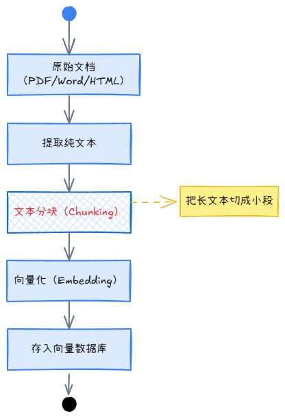
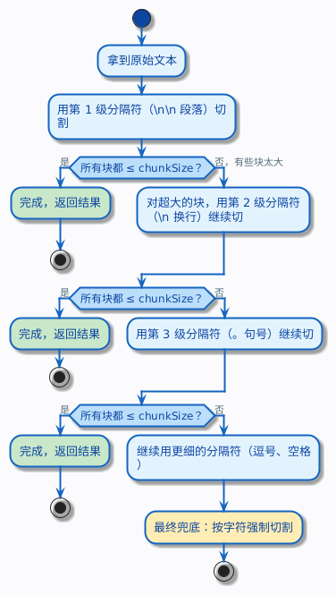
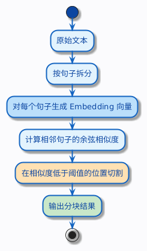

# 六、文本分块

## 1. 什么是RAG中的文本分块（Text Chunking）？

文本分块（Text Chunking）是构建 RAG 流程的关键步骤。它的原理是将加载后的长篇文档，切分成更小、更易于处理的单元。这些被切分出的文本块，是后续向量检索和模型处理的基本单位。
下图展示文本分块在RAG中的工作流程：

## 2. 为什么要进行文本分块？

### 2.1、突破大语言模型的长度限制

大型语言模型（LLM）的输入有“上下文窗口”限制，不能直接处理整本百科全书。若不进行分块，超长文档会被强制截断，导致信息丢失。

### 2.2、实现精准“大海捞针”，提升检索效率与精度

RAG 的核心是“先检索，后生成”。如果让 AI 在一整篇 10 万字的文档中寻找几句关键信息，不仅计算量巨大、响应缓慢，还会因为信息被稀释导致答案不准确。
相反，将文档预先切分成语义相关的小块，AI 就能在向量空间中快速、精准地定位到最相关的信息。

### 2.3、保留完整语义，避免上下文断裂

糟糕的分块如同用尺子把“我喜欢吃苹果”机械地切为“我喜欢吃苹”和“果”，会使 AI 无法理解其含义。好的分块策略会遵循语义边界（如句子、段落、主题），确保每个块内部信息完整。
为防止跨块信息丢失，常引入 overlap（重叠） 机制，让相邻块共享部分内容以保证上下文连贯，重叠比例通常为 10%-20%。高质量的文本块是 LLM 进行准确推理和生成答案的优质“燃料”。

### 2.4、支撑高效索引，奠定向量检索基础

RAG 系统的“记忆力”来自向量数据库。分块是将文本转为向量并存入数据库的前提。只有当文档被切分成信息密度高、语义清晰的文本块，并生成高质量的向量时，AI 才能基于语义相似度“回忆”起正确的知识。

### 2.5、实现检索粒度的灵活匹配

分块让你可以像调整搜索引擎的“精度旋钮”，根据场景灵活调整策略：

- 小文本块（约 256-512 tokens）：信息密度极高，适合需要精确匹配的事实类查询（如“产品A的保修期是多久？”），但上下文较少。
- 大文本块（约 512-1024 tokens）：包含更丰富的背景信息，适合需要宏观理解的上下文繁重型任务（如“总结这份报告的要点”），但可能引入噪声。

### 2.6、挑战与权衡

在选择分块策略时，也需考虑其在计算成本（如语义分块）、实现复杂度（如智能体分块）、通用性以及语义边界确定等方面的不同侧重。

## 3. 几个关键参数：chunkSize、overlap

在动手切之前，有两个参数必须搞清楚：`chunkSize`（块大小）和 `overlap`（重叠量）。

#### 3.1 chunkSize 怎么理解

chunkSize 就是每个块的长度上限。比如你设 chunkSize = 200，意思是每个块最多包含 200 个字符（或 200 个 token，取决于你用什么单位，后面会说）。

chunkSize 设多大合适？这没有标准答案，但有一个基本的权衡：

* 块太大（比如 2000 字）：每个块包含的信息多，但检索时容易混入不相关的内容，精度下降。就像用户问退货政策，结果返回了一整章包含退货、换货、维修的内容，模型还得自己从里面挑。
* 块太小（比如 50 字）：每个块很精准，但可能把一个完整的意思切断了，上下文丢失。就像把一条退货规则从中间劈开，前半句和后半句单独看都不知道在说什么。

一般来说，200 到 1000 个字符是比较常见的范围，具体取决于你的文档类型和检索需求。

#### 3.2 overlap 是什么，为什么需要它

overlap（重叠）是指相邻两个块之间共享的文本长度。

打个比方：你在看一本小说，每次只能记住一页的内容。如果你严格按页翻，第 1 页看完翻到第 2 页，那第 1 页最后一句话和第 2 页第一句话之间的联系就断了。但如果你每次翻页时，把上一页最后几行重新看一遍，这几行就是重叠的部分，它帮你保持了上下文的连贯性。

用一个具体的例子来看。假设知识库里有这样一段退货政策：

> 自签收之日起 7 天内，商品未经使用且不影响二次销售的，消费者可申请七天无理由退货。生鲜食品、定制商品、贴身衣物等特殊品类不适用此规则，具体以商品详情页标注为准。

如果 chunkSize = 40，不加 overlap，切出来可能是：

* 块 1：`自签收之日起 7 天内，商品未经使用且不影响二次销售的，消费者可申请七天`
* 块 2：`无理由退货。生鲜食品、定制商品、贴身衣物等特殊品类不适用此规则，具体`
* 块 3：`以商品详情页标注为准。`

注意看，“七天无理由退货”这个关键词被切成了两半，分别落在块 1 和块 2 里。用户搜“七天无理由退货”，两个块都匹配不完整。

##### 3.2.1 不加 overlap 会丢失什么

上面的例子已经很直观了——不加 overlap，相邻块的边界处一定会丢失上下文。如果用户恰好问的问题涉及到边界处的内容，检索就可能找不到完整的答案。

加上 overlap = 15 之后，切出来变成：

* 块 1：`自签收之日起 7 天内，商品未经使用且不影响二次销售的，消费者可申请七天`
* 块 2：`消费者可申请七天无理由退货。生鲜食品、定制商品、贴身衣物等特殊品类不适`
* 块 3：`特殊品类不适用此规则，具体以商品详情页标注为准。`

块 2 的开头和块 1 的结尾有重叠，“七天无理由退货”在块 2 里是完整的了。

当然，overlap 也不是越大越好。overlap 太大意味着大量重复文本，存储和计算成本都会上升。一般经验是 overlap 设为 chunkSize 的 10%\~25%。

#### 3.3 用什么单位：字符 vs token

你可能注意到了，前面说 chunkSize 的时候，有时说字符，有时说 token。这两个东西不一样，有必要区分一下。

字符（Character）就是你肉眼看到的每一个符号。“你好”是 2 个字符，"Hello"是 5 个字符，空格和标点也各算 1 个字符。

Token 是大模型实际处理文本的最小单位。大模型不是一个字一个字地读文本的，它会先把文本切成一个个 token。对于英文，一个常见单词通常是 1 个 token，长一点的单词可能被拆成 2-3 个 token。对于中文，一个汉字通常是 1-2 个 token。

举个例子：

| 文本           | 字符数 | 大约 token 数 |
| -------------- | ------ | ------------- |
| 七天无理由退货 | 7      | 7-10          |
| Hello World    | 11     | 2             |
| 退货政策       | 4      | 4-6           |

为什么要关心这个？因为大模型的上下文窗口是按 token 算的，不是按字符算的。如果你用字符数来设 chunkSize，实际消耗的 token 数可能比你预期的多（尤其是中文场景）。

不过在入门阶段，用字符数来设 chunkSize 完全够用。等你对 token 有了更深的理解，再考虑切换到基于 token 的分块也不迟。

## 4. 如何进行文本分块？

根据文档类型和任务选择合适策略是成功关键，以下是几种主流策略：

| 策略类型                                     | 核心原理                                                             | 优点                                             | 缺点                               |
| -------------------------------------------- | -------------------------------------------------------------------- | ------------------------------------------------ | ---------------------------------- |
| **固定大小分块-Fixed Size Chunking**         | 按预设的字符数或 Token 数机械切分。                                  | 简单、速度快、可预测。                           | 易破坏语义完整性。                 |
| **重叠分块-Overlapping Chunking**            | 相邻块之间保留一定比例（如 10%-25%）的重复内容，以保持上下文连贯。   | 有效减少边界信息丢失，提升检索召回率。           | 存储成本增加，块之间存在冗余内容。 |
| **递归分块-Recursive Chunking**              | 按优先级顺序（段落→句子→空格→字符）递归切分，直至块大小符合要求。 | 在满足大小限制的同时，最大限度保留文档逻辑结构。 | 实现稍复杂，有一定性能开销。       |
| **语义分块-Semantic Chunking**               | 计算句子 Embedding 的相似度，在主题切换处（相似度下降）切分。        | 语义高度连贯，检索质量高。                       | 计算成本高，速度慢。               |
| **基于文档结构分块-Document Based Chunking** | 利用标题、表格、页码等文档自身结构进行切分。                         | 贴合文档逻辑结构，信息组织性强。                 | 依赖高质量文档解析，通用性弱。     |
| **智能体 (Agentic) 分块-LLM-based Chunking** | 由 Agent 根据任务（如总结、问答）动态决定如何切分。                  | 灵活性和针对性强。                               | 实现复杂，目前不普及。             |
| **混合分块-Hybrid Chunking**                 | 结合多种分块策略，如 Token 分块 + 语义相似度合并。                   | 综合多种策略优势，兼顾效率与语义完整性。         | 实现复杂度较高，参数调优复杂。     |

## 5. 文本分块示例

> 文档示例：[RAG面试题.pdf](../src/main/resources/chunking/RAG%E9%9D%A2%E8%AF%95%E9%A2%98.pdf)
>
> chunk在线地址：https://chunkviz.up.railway.app/

### 5.1、固定大小分块（Fixed Size Chunking）

固定大小分块是一种简单的分块策略，它按照预设的字符数或 Token 数将文档机械切分。
它不管你这一刀切在段落中间还是句子中间，到了字数就切。这既是它的优点（简单），也是它的缺点（可能切断语义）。

| 维度   | 说明                                                                               |
| ------ | ---------------------------------------------------------------------------------- |
| 优点   | 实现极其简单，性能好，不需要任何 NLP 处理                                          |
| 缺点   | 完全忽略文本结构，容易把句子、段落从中间切断，导致语义不完整                       |
| 适合   | 文本结构不重要的场景，比如日志文件、纯数据文本；或者作为其他策略的兜底方案         |
| 不适合 | 有明确段落结构的文档（知识库、产品手册、政策文件），因为切断语义会严重影响检索质量 |

### 5.2、重叠分块（Overlapping Chunking）

### 5.3、【常用】递归分块（Recursive Chunking）

递归分块是目前实践中最常用的策略。它的思路可以用一句话概括：先尝试用最大的分隔符切，切完如果某个块还是太大，就换一个更小的分隔符继续切，直到所有块都在 chunkSize 以内。

具体来说，它维护一个分隔符列表，按优先级从高到低排列，过程如下：

这个先粗后细的过程就是递归的含义——不是一刀切到底，而是逐层细化。

为什么这种方式好？因为它尽最大努力保留文本的结构。能按段落切就按段落切，段落太长了才按句子切，句子还太长才按逗号切……只有在万不得已的时候才会像固定大小分块那样按字符硬切。

| 维度   | 说明                                                                                |
| ------ | ----------------------------------------------------------------------------------- |
| 优点   | 兼顾了语义完整性和块大小控制，是目前最通用的分块策略                                |
| 缺点   | 分隔符列表需要根据语言调整（中文和英文的标点不同）；依赖文本中存在合理的分隔符      |
| 适合   | 绝大多数场景，尤其是你不确定该用什么策略的时候，递归分块是最安全的默认选择          |
| 不适合 | 对分块有特殊要求的场景，比如代码文件（需要按函数/类来切）、表格数据（需要按行来切） |

### 5.4、语义分块（Semantic Chunking）

前面策略有一个共同的局限：它们都是基于规则的——要么按字数切，要么按标点符号切。它们不理解文本在说什么。

语义分块换了一个完全不同的思路：用 Embedding 模型来判断文本的语义相似度，在语义发生明显变化的地方切割。

具体过程是这样的：

1. 先把文本按句子拆开（这一步可以简单地按句号切）
2. 对每个句子生成一个向量（Embedding）
3. 计算相邻句子之间的向量相似度
4. 当相邻句子的相似度低于某个阈值时，说明话题发生了转换，在这里切一刀

这种方式的好处是显而易见的：它切出来的每个块在语义上是高度内聚的，不会出现一个块里混着两个不相关话题的情况。

相比 Embedding 计算相似度的方式，直接让大模型来做分块决策更加直观——大模型本身就具备强大的语义理解能力，可以直接读懂文本，判断哪里应该切分。

最直接的思路：把文本交给大模型，让它找出主题切换的位置。

| 维度   | 说明                                                                                               |
| ------ | -------------------------------------------------------------------------------------------------- |
| 优点   | 切割点基于语义而非规则，分块质量最高，每个块的主题高度内聚                                         |
| 缺点   | 需要调用 Embedding 或者 Chat 模型，有额外的计算成本和延迟；阈值需要调参；对模型的质量有依赖        |
| 适合   | 对检索精度要求很高的场景，比如法律文档问答、医疗知识库、金融合规文档                               |
| 不适合 | 文档量特别大且对延迟敏感的场景；文本本身结构已经很清晰的场景（用递归分块就够了，没必要上语义分块） |
